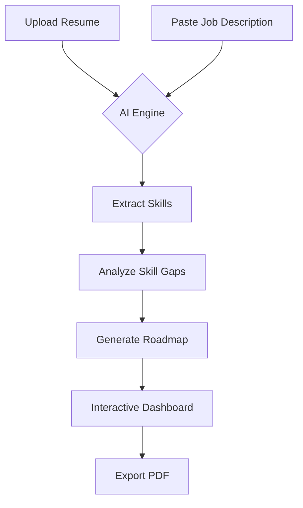

# 🚀 AI-Adaptive Onboarding Engine

<p align="center">
  
  
  
  
  
</p>

---

### **Bridge the gap between your resume and your dream job.**

The **AI-Adaptive Onboarding Engine** is a sophisticated tool designed to help professionals level up. By analyzing your resume against target job descriptions, it identifies critical skill gaps and generates a **personalized, dependency-aware learning roadmap** to get you hired faster.

---

## ✨ Key Features

- 📄 **Intelligent Resume Parsing** — Seamlessly extract skills and experience from PDF and DOCX formats.
- 🔍 **Deep JD Analysis** — Understand exactly what recruiters are looking for in any job description.
- 📊 **Dynamic Skill Gap Visualization** — Beautifully rendered Radar and Bar charts showing exactly where you stand.
- 🗺️ **Personalized Learning Roadmaps** — Smart, ordered paths with curated resources to bridge your gaps.
- 📥 **Professional PDF Export** — Download your custom roadmap for offline tracking.
- 🌗 **Premium Dark Theme** — Sleek, modern interface built for focused learning.
- ⚡ **Instant Demo Mode** — Try out the full power of the engine with pre-loaded sample data.

---

## 🛠️ Tech Stack

| Layer | Technologies |
| :--- | :--- |
| **Frontend** | React 18, Vite 5, Tailwind CSS 3, Framer Motion, Recharts |
| **Backend** | Python 3.9+, FastAPI, PyPDF2, python-docx |
| **AI/NLP** | OpenAI API (GPT-4/3.5) with advanced keyword-based NLP fallback |
| **Utilities** | Lucide React, HTML2Canvas, jsPDF |

---

## 🚀 How It Works



---

## 🏁 Quick Start

### 1. Backend Setup
```bash
cd AI-Onboarding-Engine/backend

# Initialize environment
python -m venv venv
venv\Scripts\activate  # Windows
# source venv/bin/activate # macOS/Linux

# Install dependencies
pip install -r requirements.txt

# (Optional) Configure AI
copy .env.example .env
# Add your OPENAI_API_KEY to .env

# Launch API
uvicorn app.main:app --reload --port 8000
```

### 2. Frontend Setup
```bash
cd AI-Onboarding-Engine/frontend

# Install & Build
npm install

# Start development server
npm run dev
```

### 3. Access
Open **[http://localhost:5173](http://localhost:5173)** to start your journey.

---

## 📂 Project Structure

```text
AI-Onboarding-Engine/
├── backend/
│   ├── app/
│   │   ├── main.py              # FastAPI Entry Point
│   │   ├── routers/             # API Endpoints (Analysis)
│   │   ├── services/            # Core Logic (Parsing, Analysis, Roadmap)
│   │   └── models/              # Pydantic Schemas
│   └── requirements.txt
└── frontend/
    ├── src/
    │   ├── components/          # UI Components (Charts, Cards, Navigation)
    │   ├── pages/               # Views (Dashboard, Upload, Results)
    │   └── services/            # API Integration
    ├── tailwind.config.js
    └── package.json
```

---

## 📡 API Overview

| Method | Endpoint | Description |
| :--- | :--- | :--- |
| `POST` | `/api/analyze` | Full analysis of Resume + JD |
| `GET` | `/api/demo` | Fetch pre-built sample data |
| `GET` | `/health` | System & OpenAI status check |

---

## 🤝 Contributing

Contributions are welcome! Please feel free to submit a Pull Request.

1. Fork the Project
2. Create your Feature Branch (`git checkout -b feature/AmazingFeature`)
3. Commit your Changes (`git commit -m 'Add some AmazingFeature'`)
4. Push to the Branch (`git push origin feature/AmazingFeature`)
5. Open a Pull Request

---

## 📄 License

Distributed under the **MIT License**. See `LICENSE` for more information.

<p align="center">
  Built with ❤️ by the AI-Onboarding-Engine Team
</p>